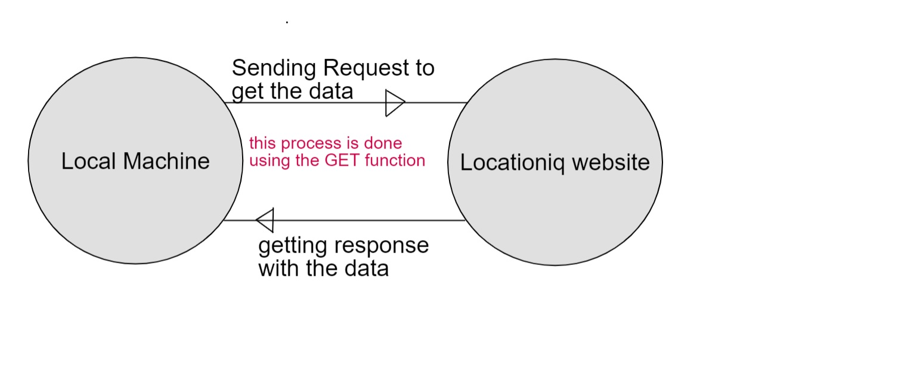
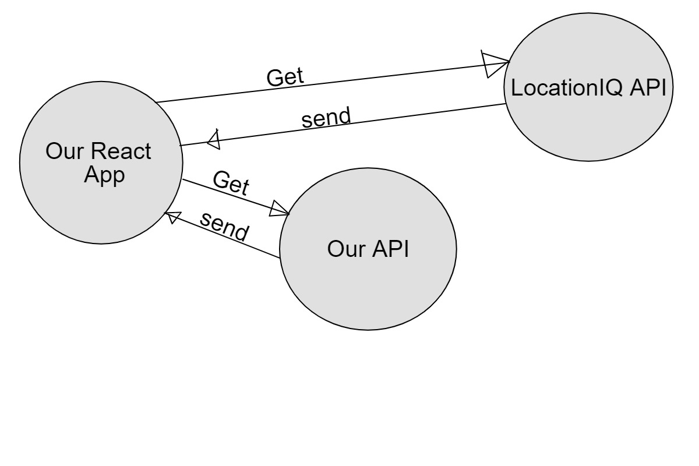
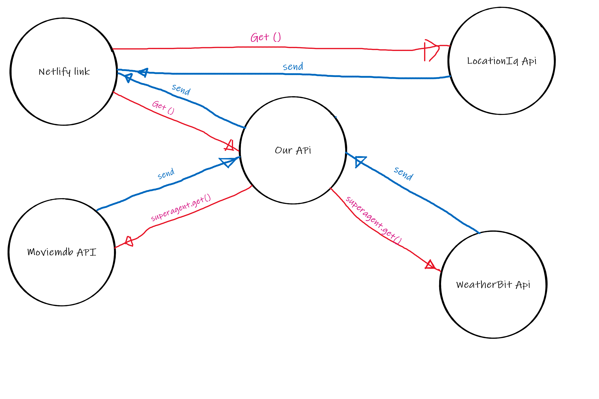

# City explorer

**Author**: Mohammad Jaradat

## Getting Started

to get this application on your machine use the git clone command on your terminal and then navigate the the repo location after that type `npm i' then 'npm start'

## Overview

This Application was made to get any city's map location and its countrey only by typing the city name in the search bar

## Architecture
this application was built using ReactJs , React axios library and Locationiq API

## Lab06

**Version**: 1.0.0 (increment the patch/fix version number if you make more commits past your first submission)

## Credit and Collaborations

**Enas batayneh**

## Lab07

**Version**: 2.0.0 (increment the patch/fix version number if you make more commits past your first submission)

## Credit and Collaborations

**Sae'd Jabali**

## Lab08

**Version**: 3.0.0 (increment the patch/fix version number if you make more commits past your first submission)

## Credit and Collaborations

**Hatem Husnieh**

## Change Log
<!-- Use this area to document the iterative changes made to your application as each feature is successfully implemented. Use time stamps. Here's an example:

01-01-2001 4:59pm - Application now has a fully-functional express server, with a GET route for the location resource. -->

